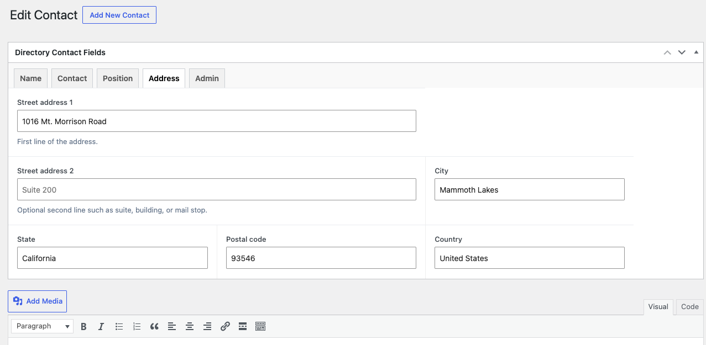

# Hero Random Images

Hero Random Images is a WordPress plugin that adds a Gutenberg hero block powered by an ACF gallery field.

The block selects one random image from the gallery and overlays editable heading, text, and button content using InnerBlocks.

## Status

- Current version: `1.2.5`
- Distribution: GitHub
- Dependency: Advanced Custom Fields Pro
- PHP linting: passed on `hero-random.php` and `inc/hero-random-block.php`

## Features

- Displays a random hero image from an ACF gallery field
- Supports heading, paragraph, and button content in the block editor
- Uses WordPress responsive image functions for `srcset` and attachment metadata
- Includes accessibility improvements for hero labeling and image handling
- Fails gracefully when ACF is missing or the gallery field is misconfigured

## Requirements

- WordPress 6.3 or newer
- PHP 7.4 or newer
- Advanced Custom Fields Pro

## Installation

1. Copy this plugin into `wp-content/plugins/hero-random`.
2. Activate the plugin in WordPress.
3. Make sure Advanced Custom Fields Pro is installed and active.
4. Create or assign an ACF gallery field for the block.
5. The plugin currently checks `hero_random` first and then `gallery`.
6. Add the `Hero (Random ACF Image)` block in the editor.

## Development

- Main plugin file: `hero-random.php`
- Render template: `inc/hero-random-block.php`
- Stylesheet: `inc/hero-random.css`
- Local lint command:

```bash
/opt/homebrew/bin/php -l hero-random.php
/opt/homebrew/bin/php -l inc/hero-random-block.php
```

## Screenshots

Add screenshots to `docs/screenshots/` using these filenames:

- `editor-preview.png` for the block in the editor
- `frontend-preview.png` for the rendered hero on the front end

### Editor Preview



### Front-End Preview


## Files

- `hero-random.php` plugin bootstrap and block registration
- `inc/hero-random-block.php` block render template
- `inc/hero-random.css` shared front-end and editor styling
- `readme.txt` WordPress-style plugin readme
- `docs/screenshots/` optional GitHub documentation images

## Notes

- This plugin is distributed through GitHub and is not currently intended for the WordPress.org plugin directory.
- The block depends on ACF block registration and ACF gallery field data.

## Changelog

### 1.2.5

- Improved accessibility for hero labeling and image handling
- Simplified stylesheet loading so editor and front end stay aligned
- Added safer gallery image resolution and attachment validation
- Added dependency notice and release metadata
- Added GitHub project documentation

## License

GPL-2.0-or-later. See [GNU GPL v2.0](https://www.gnu.org/licenses/gpl-2.0.html).
